# Rick & Morty Explorer

A production-ready Flutter application for exploring the Rick and Morty universe (Character
endpoints), built as a technical assessment for the **Flutter Developer Internship at EASY WORLD
ESTABLISHMENT DIGITAL MARKETING**.

**Repository:** <https://github.com/nancyAali22/rick-morty-explorer>

## Overview

This isn't a "make it work" submission — it's built the way a senior Flutter engineer would
structure a real production app: strict Clean Architecture with three independent layers per
feature, Cubit-based state management with `Either<Failure, Success>` error handling throughout,
dependency injection via `get_it`, and a fully custom design system rather than defaults.

One deliberate UI/UX decision worth calling out: the entire app uses a **warm mint / beige /
soft-brown palette** (`AppColors` / `AppTheme`), intentionally *not* the franchise's default
green/blue. Every screen reads colors exclusively through `Theme.of(context)` or the shared
`AppColors` tokens — never a hardcoded `Color(0x...)` inside a widget. The app also ships a **fully
manual light/dark theme switcher** (persisted locally, never tied to the OS setting) with an
animated toggle and a smooth `AnimatedTheme` transition across every screen.

## Architecture

**Clean Architecture**, three strict layers per feature:

```
┌─────────────────────────────────────────────┐
│ Presentation                                 │
│ Pages · Widgets · Cubit (state + events)     │
│ (no business logic, no Dio)                  │
└───────────────────┬───────────────────────────┘
                    │ calls
┌───────────────────▼───────────────────────────┐
│ Domain                                       │
│ Entities · Repository interface · UseCases   │
│ (pure Dart — no Flutter, no Dio)             │
└───────────────────┬───────────────────────────┘
                    │ implemented by
┌───────────────────▼───────────────────────────┐
│ Data                                         │
│ Models · Remote DataSource · Repository Impl │
│ (Dio, JSON parsing, exceptions)              │
└─────────────────────────────────────────────────┘
```

- **State management**: `flutter_bloc` (Cubit) — one Cubit per concern (`CharactersCubit` owns
  fetch/search/filter/pagination; `ExportCubit` owns the export flow; `ThemeCubit` owns the
  light/dark mode — each single-responsibility, none overlapping).
- **Repository Pattern**: `CharactersRepository` is an abstract interface in the domain layer;
  `CharactersRepositoryImpl` (data layer) is the only implementation, so the presentation/domain
  layers never know Dio exists.
- **Dependency Injection**: `get_it`, registered per feature in `injection_container.dart`.
- **Error handling**: every use case returns `Either<Failure, T>` (via `dartz`) — the UI never
  touches a raw exception, only typed `Failure`s (`NetworkFailure`, `ServerFailure`,
  `UnknownFailure`, `ExportFailure`).

## Folder Structure

```
lib/
├── core/
│   ├── constants/     # API + app-wide constants
│   ├── di/            # get_it injection container
│   ├── error/         # Failure & Exception types
│   ├── network/       # DioClient, NetworkInfo
│   ├── router/        # go_router config, route names
│   ├── theme/         # AppColors, AppTheme, ThemeCubit, theme storage & widgets
│   └── usecase/       # Base UseCase<Type, Params> contract
│
└── features/
    ├── characters/
    │   ├── data/           # models, remote datasource, repository impl
    │   ├── domain/         # entities, repository interface, use case
    │   └── presentation/   # Cubit, pages, reusable widgets
    │
    ├── export/
    │   ├── domain/usecases/     # ExportCharactersUseCase
    │   ├── services/            # ExcelBuilderService, FileSaverService
    │   ├── presentation/cubit/  # ExportCubit, ExportState
    │   └── widgets/             # ExportFabButton
    │
    └── splash/
        └── presentation/
            ├── pages/    # SplashPage (fully custom, animated)
            └── widgets/  # gradient background, logo mark, wordmark
```

## Features

- [x] Fetch all characters (paginated, infinite scroll)
- [x] Search characters by name
- [x] Filter by status / species / gender
- [x] Character details with Hero animation
- [x] Export displayed (filtered) characters to `.xlsx`
- [x] Skeleton loading, pull-to-refresh, retry & empty states
- [x] Manual light/dark theme switcher, persisted locally (never follows the OS)
- [x] Fully responsive (phones & tablets) via `flutter_screenutil`
- [x] Remembers last search/filter/scroll position while navigating

## Packages Used

| Package                  | Why                                                                          |
|---------------------------|--------------------------------------------------------------------------------|
| flutter_bloc / equatable | Cubit-based state management with value equality                              |
| dio                      | HTTP client with base config, timeouts, logging interceptor                   |
| get_it                   | Dependency Injection across all layers                                        |
| go_router                | Declarative routing, typed route params                                       |
| flutter_screenutil       | Responsive sizing (`.w` `.h` `.sp` `.r`) across devices                       |
| cached_network_image     | Efficient avatar loading & disk caching                                       |
| shimmer                  | Skeleton loading placeholders                                                 |
| excel                    | Building the `.xlsx` workbook in `ExcelBuilderService`                        |
| path_provider            | App-sandboxed directory for the exported file (no runtime permission needed)  |
| open_file                | Opening/sharing the exported file via the OS                                  |
| connectivity_plus        | Detecting offline state before hitting the network                            |
| dartz                    | `Either<Failure, Success>` functional error handling                          |
| shared_preferences       | Persisting the user's manually chosen theme mode                              |
| flutter_animate          | Splash screen and theme-toggle animations                                     |

## Setup

Requires Flutter 3.x (Dart SDK `>=3.3.0 <4.0.0`).

```bash
flutter pub get
flutter run
```

## Screenshots

| Screen                  | Preview                                            |
|--------------------------|-----------------------------------------------------|
| Splash                  | 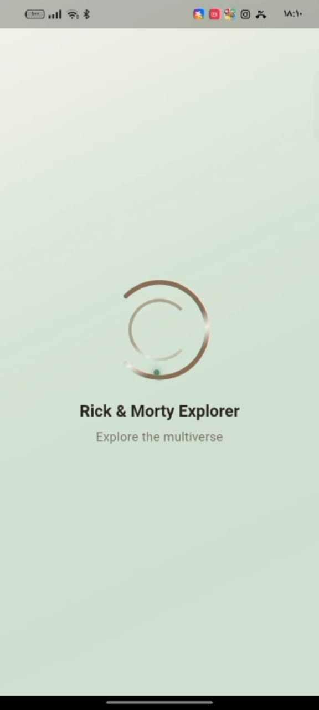                  |
| Characters List — Light | 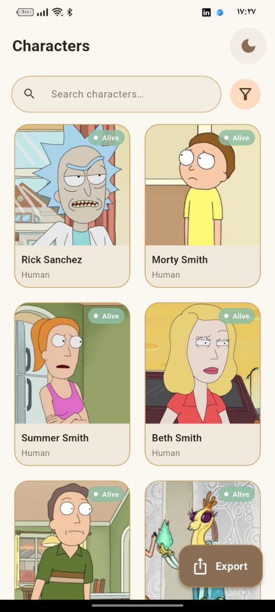          |
| Characters List — Dark  | 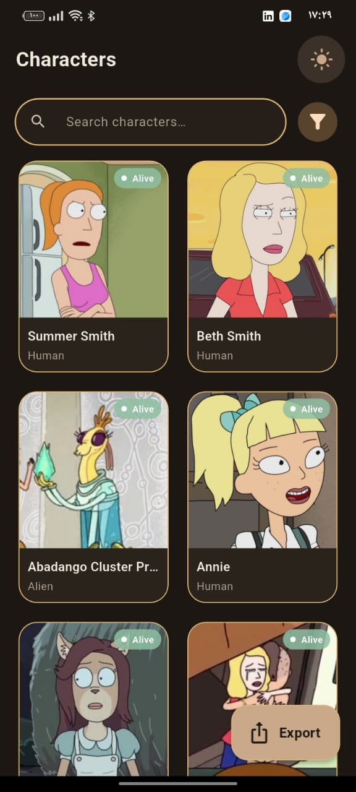            |
| Search                  | 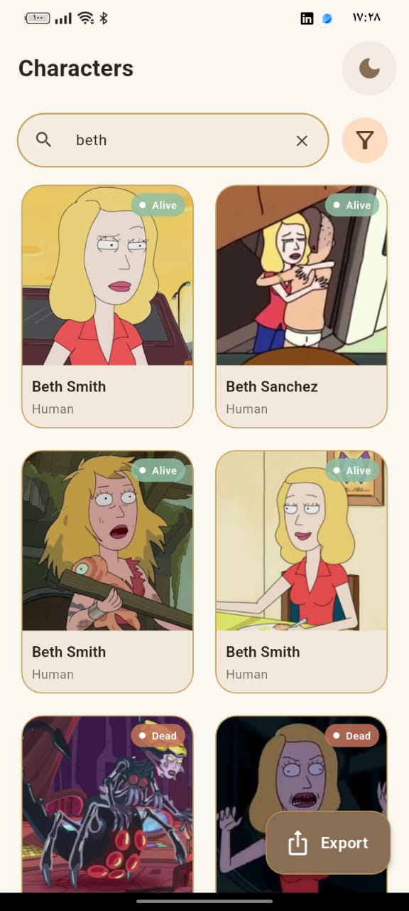                  |
| Filter Sheet            | 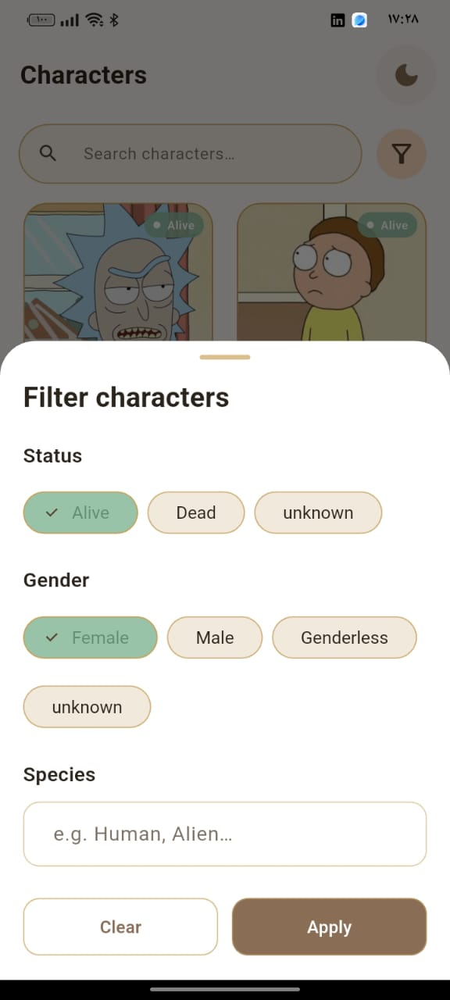                |
| Filter Dark             | 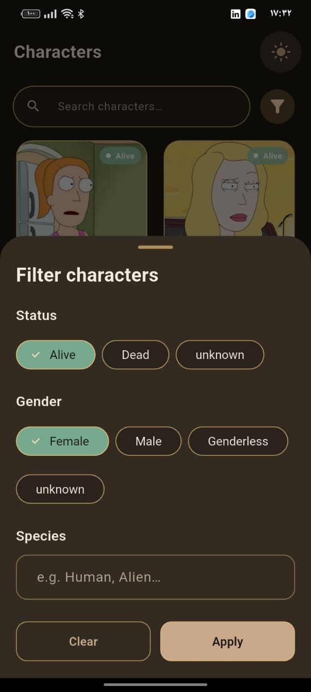      |
| Character Details       | 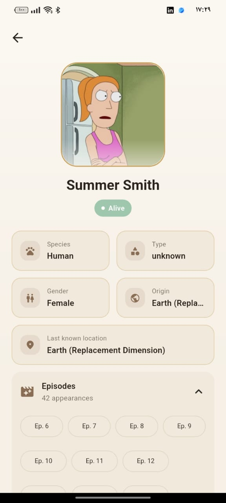                |
| Character Details Dark  | 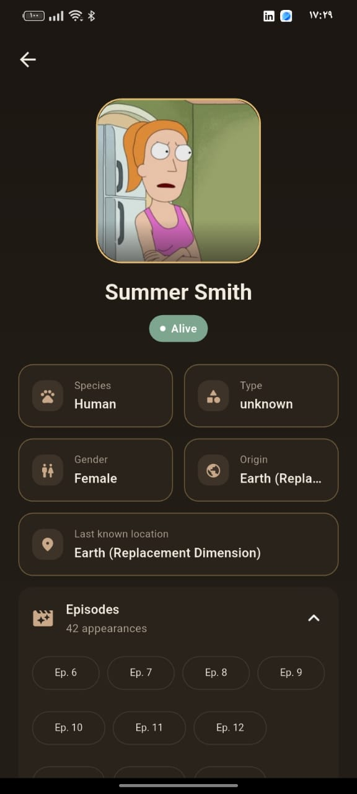      |
| Export Success          | 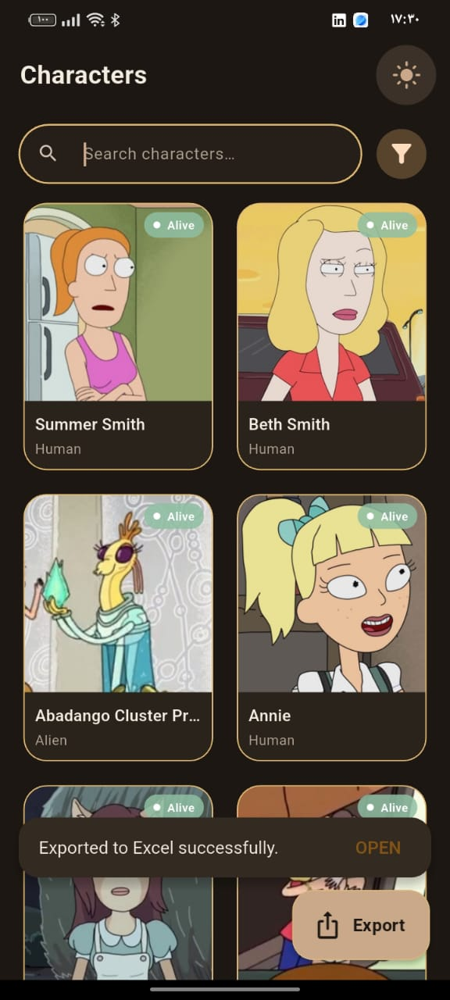  |
| Empty State             | 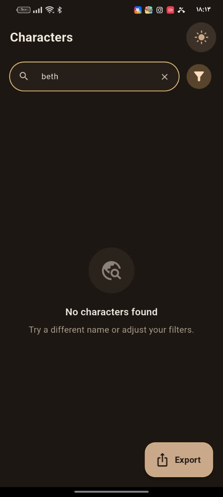              |
| Error State             | 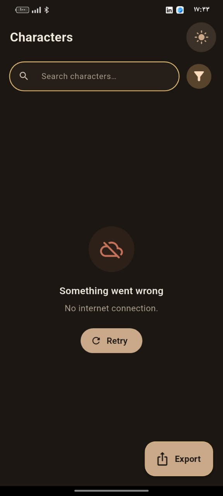              |

## Demo Video

<https://drive.google.com/file/d/191TKvNW1gCrzi4f2FmURPfqxMmrrq6rD/view?usp=drivesdk>

## Self Review Checklist

| Requirement                             | Status | Where                                                                                                        |
|-------------------------------------------|--------|------------------------------------------------------------------------------------------------------------------|
| Flutter + State Management (Bloc/Cubit) | ✔      | `flutter_bloc` throughout, `CharactersCubit` / `ExportCubit` / `ThemeCubit`                                  |
| Fetch all characters                    | ✔      | `GetCharactersUseCase` → `CharactersCubit.loadFirstPage/loadNextPage`                                        |
| Filter/Search characters                | ✔      | `CharacterSearchBar`, `CharacterFilterSheet` → `CharactersCubit.search/applyFilters`                         |
| Export to Excel (.xlsx)                 | ✔      | `lib/features/export/` — `ExcelBuilderService`, `FileSaverService`, `ExportCharactersUseCase`, `ExportCubit` |
| Clean, readable code                    | ✔      | Single-responsibility classes throughout                                                                     |
| Organized project structure             | ✔      | `lib/core` + `lib/features/*` — see Folder Structure                                                         |
| Reusable components                     | ✔      | `StatusBadge`, `DetailInfoTile`, `CharacterCard`, `ThemeToggleButton` reused across screens                  |
| UI quality & consistency                | ✔      | Single `AppTheme`/`AppColors` source, no hardcoded colors anywhere                                           |
| Loading / empty / error states          | ✔      | `CharactersSkeletonGrid`, `CharactersEmptyState`, `CharactersErrorState`                                     |
| Clean, meaningful commits               | ✔      | [Commit history](https://github.com/nancyAali22/rick-morty-explorer/commits/main)                            |

---